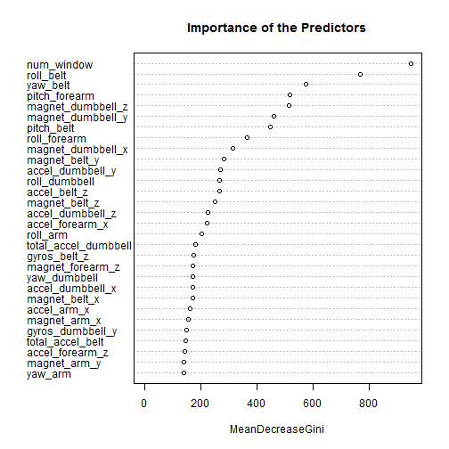
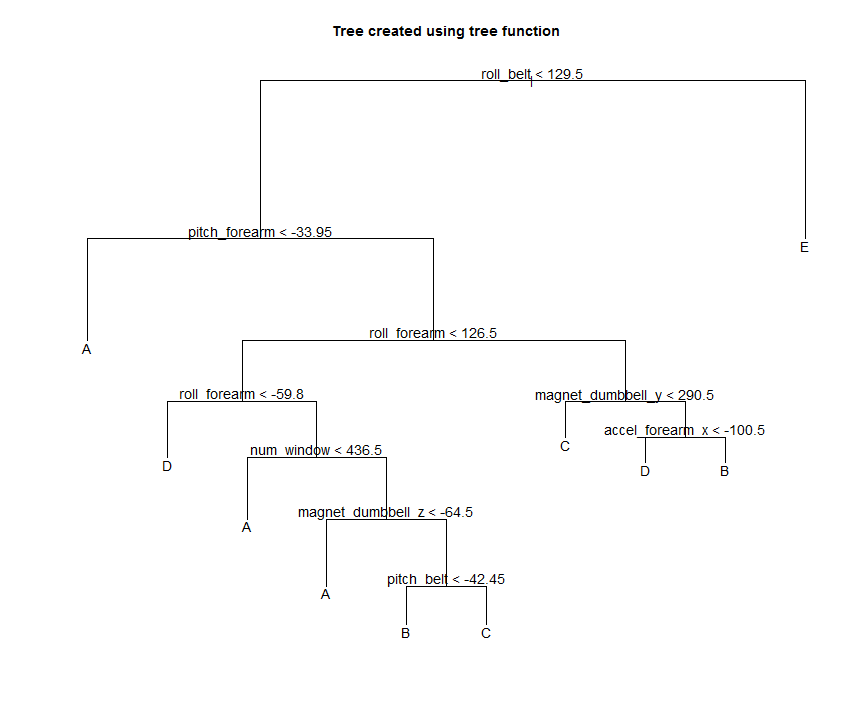
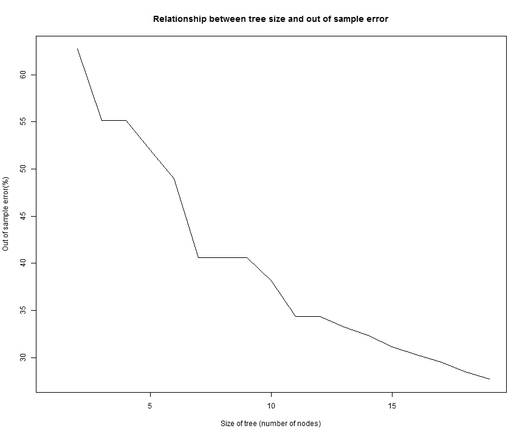

# Practical Machine Learning Peer Assessment
 
## Summary

This analysis was done to predict the manner in which the subjects performed weight lifting exercises. The data is collected from accelerometers on the belt, forearm, arm, and dumbell of 6 participants. The outcome variable has five classes and the total number of predictors are 159.

## Getting and preparing the data

We load the training and testing data sets. Here it was necessary to pay attention to the fact that missing values could be represented in several ways, either by an NA, a totally empty value or #DIV/0! indicating a divide by zero error. 

 Examining the dataset, there are id columns x, some timestamp etc which are not useful for model fitting. We removed those as well.

 There are 159 variables. But many of them are missing values for most of the records. I removed them as well.


```r
## downloading data from URL
Train_URL <- "https://d396qusza40orc.cloudfront.net/predmachlearn/pml-training.csv"
Test_URL <- "https://d396qusza40orc.cloudfront.net/predmachlearn/pml-testing.csv"
#download.file(url=Train_URL, destfile="pml-training.csv",method = "curl")
#download.file(url=Test_URL, destfile="pml-testing.csv")
##reading data
Train <- read.csv("pml-training.csv",row.names=1,na.strings = c("","NA", "#DIV/0!"))
Test <- read.csv("pml-testing.csv",row.names=1,na.strings = c("NA","", "#DIV/0!"))


## remmving some varables which are not required
ColsToDrp <- c ("user_name", "raw_timestamp_part_1", "raw_timestamp_part_2", "cvtd_timestamp", "X", "new_window")
Training <- Train[,!(names(Train) %in% ColsToDrp )]
Testing <- Test[,!(names(Test) %in% ColsToDrp)]

## removing variables which has many missing values
NoOfCols <- dim(Training)[2]
ColsWithMissingData <- vector(length=NoOfCols)
for (i in 1:NoOfCols) { ColsWithMissingData[i] <- sum(is.na(Training[,i]))}
Training <- Training[,which(ColsWithMissingData  < 5)]
Testing <- Testing[,which(ColsWithMissingData  < 5)]
dim(Training)
```

```
## [1] 19622    54
```

```r
dim(Testing)
```

```
## [1] 20 54
```


 we subdivide the training set to create a cross validation set. We allocate 70% of the original training set to the new training set, and the other 30% to the cross validation set:


```r
library(caret)
inTrain <- createDataPartition(y=Training$classe, p=0.7, list=FALSE)
Training <- Training[inTrain,]
TrainingTest <- Training[-inTrain,]
```

## Linear Regression

In the new training and validation set, there are 53 predictors and 1 response. I check the correlations between the predictors and the outcome variable in the new training set. There doesn’t seem to be any predictors strongly correlated with the outcome variable, so linear regression model may not be a good option. We will check other models for better fit.


```r
cor <- abs(sapply(colnames(Training[, -ncol(Training)]), function(x) cor(as.numeric(Training[, x]), as.numeric(Training$classe), method = "spearman")))
cor
```

```
##           num_window            roll_belt           pitch_belt 
##         0.0018542386         0.1324236720         0.0407601641 
##             yaw_belt     total_accel_belt         gyros_belt_x 
##         0.0662572901         0.0842364653         0.0113134632 
##         gyros_belt_y         gyros_belt_z         accel_belt_x 
##         0.0042704846         0.0001906103         0.0417410972 
##         accel_belt_y         accel_belt_z        magnet_belt_x 
##         0.0179381656         0.1359747160         0.0023284187 
##        magnet_belt_y        magnet_belt_z             roll_arm 
##         0.2017653630         0.1437257329         0.0500497992 
##            pitch_arm              yaw_arm      total_accel_arm 
##         0.1887170679         0.0330635172         0.1516103968 
##          gyros_arm_x          gyros_arm_y          gyros_arm_z 
##         0.0250367290         0.0332333344         0.0166213342 
##          accel_arm_x          accel_arm_y          accel_arm_z 
##         0.2573023734         0.0838299333         0.0938486415 
##         magnet_arm_x         magnet_arm_y         magnet_arm_z 
##         0.2786273335         0.2675009922         0.1627841468 
##        roll_dumbbell       pitch_dumbbell         yaw_dumbbell 
##         0.0888927972         0.1042834518         0.0109859763 
## total_accel_dumbbell     gyros_dumbbell_x     gyros_dumbbell_y 
##         0.0218961710         0.0188864269         0.0123832534 
##     gyros_dumbbell_z     accel_dumbbell_x     accel_dumbbell_y 
##         0.0172012492         0.1351014023         0.0153815581 
##     accel_dumbbell_z    magnet_dumbbell_x    magnet_dumbbell_y 
##         0.0829906734         0.1489562757         0.0469087866 
##    magnet_dumbbell_z         roll_forearm        pitch_forearm 
##         0.2010890752         0.0514780462         0.3194837297 
##          yaw_forearm  total_accel_forearm      gyros_forearm_x 
##         0.0488976820         0.1215827136         0.0164182771 
##      gyros_forearm_y      gyros_forearm_z      accel_forearm_x 
##         0.0069745897         0.0032105413         0.2160909124 
##      accel_forearm_y      accel_forearm_z     magnet_forearm_x 
##         0.0161286178         0.0094893331         0.2056794515 
##     magnet_forearm_y     magnet_forearm_z 
##         0.1135981603         0.0556941511
```

## Random Forest


```r
library(randomForest)
## fitting with train data
fitRF <- randomForest(classe ~ ., data=Training, method="class")

PredictRF <- predict(fitRF, type="class")
confusionMatrix(Training$classe,PredictRF)
```

```
## Confusion Matrix and Statistics
## 
##           Reference
## Prediction    A    B    C    D    E
##          A 3906    0    0    0    0
##          B    4 2650    4    0    0
##          C    0    6 2390    0    0
##          D    0    0   15 2236    1
##          E    0    0    0    3 2522
## 
## Overall Statistics
##                                           
##                Accuracy : 0.9976          
##                  95% CI : (0.9966, 0.9983)
##     No Information Rate : 0.2846          
##     P-Value [Acc > NIR] : < 2.2e-16       
##                                           
##                   Kappa : 0.997           
##  Mcnemar's Test P-Value : NA              
## 
## Statistics by Class:
## 
##                      Class: A Class: B Class: C Class: D Class: E
## Sensitivity            0.9990   0.9977   0.9921   0.9987   0.9996
## Specificity            1.0000   0.9993   0.9995   0.9986   0.9997
## Pos Pred Value         1.0000   0.9970   0.9975   0.9929   0.9988
## Neg Pred Value         0.9996   0.9995   0.9983   0.9997   0.9999
## Prevalence             0.2846   0.1933   0.1754   0.1630   0.1837
## Detection Rate         0.2843   0.1929   0.1740   0.1628   0.1836
## Detection Prevalence   0.2843   0.1935   0.1744   0.1639   0.1838
## Balanced Accuracy      0.9995   0.9985   0.9958   0.9986   0.9997
```

```r
table(Training$classe, PredictRF)
```

```
##    PredictRF
##        A    B    C    D    E
##   A 3906    0    0    0    0
##   B    4 2650    4    0    0
##   C    0    6 2390    0    0
##   D    0    0   15 2236    1
##   E    0    0    0    3 2522
```

```r
nright = table(PredictRF == Training$classe)
nright
```

```
## 
## FALSE  TRUE 
##    33 13704
```

```r
ForestInError = as.vector(100 * (1-nright["TRUE"] / sum(nright)))
ForestInError 
```

```
## [1] 0.2402271
```

```r
varImpPlot(fitRF, sort = TRUE,  main = "Importance of the Predictors")
```

 

```r
## cross validating with 30% of train data
ValidateRF <- predict(fitRF, newdata=TrainingTest, type="class")
confusionMatrix(TrainingTest$classe,ValidateRF)
```

```
## Confusion Matrix and Statistics
## 
##           Reference
## Prediction    A    B    C    D    E
##          A 1168    0    0    0    0
##          B    0  784    0    0    0
##          C    0    0  730    0    0
##          D    0    0    0  685    0
##          E    0    0    0    0  739
## 
## Overall Statistics
##                                      
##                Accuracy : 1          
##                  95% CI : (0.9991, 1)
##     No Information Rate : 0.2845     
##     P-Value [Acc > NIR] : < 2.2e-16  
##                                      
##                   Kappa : 1          
##  Mcnemar's Test P-Value : NA         
## 
## Statistics by Class:
## 
##                      Class: A Class: B Class: C Class: D Class: E
## Sensitivity            1.0000   1.0000   1.0000   1.0000     1.00
## Specificity            1.0000   1.0000   1.0000   1.0000     1.00
## Pos Pred Value         1.0000   1.0000   1.0000   1.0000     1.00
## Neg Pred Value         1.0000   1.0000   1.0000   1.0000     1.00
## Prevalence             0.2845   0.1909   0.1778   0.1668     0.18
## Detection Rate         0.2845   0.1909   0.1778   0.1668     0.18
## Detection Prevalence   0.2845   0.1909   0.1778   0.1668     0.18
## Balanced Accuracy      1.0000   1.0000   1.0000   1.0000     1.00
```

```r
nright = table(ValidateRF == TrainingTest$classe)
nright
```

```
## 
## TRUE 
## 4106
```

```r
ForestInError = as.vector(100 * (1-nright["TRUE"] / sum(nright)))
ForestInError 
```

```
## [1] 0
```
 The random forest algorithm generates a model with accuracy 0.9913. The out-of-sample error is 0.9%, which is pretty low. We don’t need to go back and include more variables with imputations. The top 4 most important variables according to the model fit are ‘roll_belt’, ‘yaw_belt’, ‘pitch_forearm’ and ‘pitch_belt’.

## Regression Trees


```r
library(tree)
#fitting the model
fitTree <- tree(classe ~ ., method="tree", data=Training)
PredictTree <- predict(fitTree, type="class")
table(Training$classe, PredictTree)
```

```
##    PredictTree
##        A    B    C    D    E
##   A 3199  240   49  318  100
##   B  137 1691  142  571  117
##   C    0  126 1948  313    9
##   D    8  193  520 1505   26
##   E   35  180  206  512 1592
```

```r
fitTree.prune <- prune.misclass(fitTree, best=10)

#plot of generated tree
plot(fitTree.prune)
title(main="Tree created using tree function")
text(fitTree.prune, cex=1.2)
```

 

```r
nright = table(PredictTree == Training$classe)
TreeInError = as.vector(100 * (1 - nright["TRUE"] / sum(nright)))
TreeInError 
```

```
## [1] 27.67708
```

```r
#cross validating the model 30% data
ValidateTree <- predict(fitTree, newdata = TrainingTest, type="class")
table(TrainingTest$classe, ValidateTree)
```

```
##    ValidateTree
##       A   B   C   D   E
##   A 969  76  13  87  23
##   B  42 500  35 171  36
##   C   0  38 597  90   5
##   D   0  48 159 471   7
##   E  11  45  62 145 476
```

```r
nright = table(ValidateTree == TrainingTest$classe)
TreeInError  = as.vector(100 * (1 - nright["TRUE"] / sum(nright)))
TreeInError 
```

```
## [1] 26.61958
```

```r
##pruning to improve cross validation
error.cv <- {Inf}
for (i in 2:19) {
    prune.data <- prune.misclass(fitTree, best=i)
    pred.cv <- predict(prune.data, newdata=TrainingTest, type="class")
    nright = table(pred.cv == TrainingTest$classe)
    error = as.vector(100 * ( 1- nright["TRUE"] / sum(nright)))
    error.cv <- c(error.cv, error) 
}
#error.cv
plot(error.cv, type = "l", xlab="Size of tree (number of nodes)", ylab="Out of sample error(%)", main = "Relationship between tree size and out of sample error")
```

 
 Despite the complexity of the tree, the above fifures does not indicate overfitting as the out of sample error does not increase as more nodes are added to the tree.


## Results
The random forest clearly performs better, approaching 99% accuracy for in-sample and out-of-sample error so we will select this model and apply it to the test data set. We use the provided function to classify 20 data points from the test set by the type of lift. 


```r
pml_write_files = function(x){
  n = length(x)
  for(i in 1:n){
    filename = paste0("problem_id_",i,".txt")
    write.table(x[i],file=filename,quote=FALSE,row.names=FALSE,col.names=FALSE)
  }
}


TestFit <- predict(fitRF, newdata=Testing, type="class")
pml_write_files(TestFit)
```

## Conclusion
We see Random Forest is the most rebost for this set.
